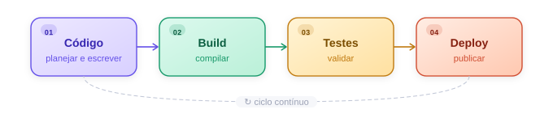

## Introdução

<div class="series-note">
  <p><strong>Série pipeline.</strong> Este é o segundo artigo da série. No <a href="/artigos/pipeline-origem-do-conceito.html">primeiro texto</a>, eu falei da origem do conceito dentro do processador. Aqui, a ideia é trazer a mesma lógica para o desenvolvimento de software.</p>
</div>

Como mencionei anteriormente, <span class="term-tooltip" data-tooltip="Pipeline é uma sequência organizada de etapas por onde o trabalho vai passando até chegar ao resultado final.">pipeline</span> é um fluxo que quebra um problema grande em várias partes menores, para que elas avancem em pequenos processos e mantenham o trabalho o mais contínuo possível.

No desenvolvimento de software, esse fluxo costuma aparecer em alguns passos principais:

Claro que nem tudo é tão simples quanto parece à primeira vista. Só na prática mesmo para entendermos o quão custosa e desafiadora pode ser cada fase. A seguir vou falar de pipeline sem falar de CI/CD, porque o conceito já existia antes.

<figure class="article-figure">
  
  <figcaption>O fluxo básico do pipeline: escrever, compilar, validar e publicar.</figcaption>
</figure>

## Etapa 1: Código

Essa é talvez a parte mais importante, porque quanto melhor fizermos ela, menos voltas daremos depois. Essa fase é marcada pela pesquisa e pelo planejamento, porque antes mesmo de começar a escrever o código, precisamos entender o que vamos fazer e como vamos fazer, pelo menos os primeiros passos.

Algumas perguntas que precisamos responder:

- Quais funcionalidades a aplicação vai ter?
- Como estruturar o projeto?
- Quais tecnologias e frameworks usar?
- Como modelar o banco de dados?
- Qual a estratégia de autenticação?

No meu projeto Museu de Bugs eu precisava de:

- Uma API que recebesse, listasse, editasse e deletasse bugs
- Um banco de dados para persistir esses bugs
- Autenticação para proteger rotas de escrita
- Um frontend que consumisse essa API

### As decisões que moldam o código

A minha aplicação era simples no escopo, mas ainda assim pedia algumas decisões técnicas. Eu precisava registrar bugs e erros no banco por meio de uma aplicação web, então fui tentando manter a estrutura enxuta sem abrir mão de uma base minimamente organizada.

Antes de escrever a primeira linha, precisei responder algumas perguntas.

**1. Qual tipo de aplicação?**  
<a class="term-tooltip" href="https://developer.mozilla.org/en-US/docs/Web/HTTP" target="_blank" rel="noopener" data-tooltip="Uma API REST expõe recursos por HTTP usando verbos como GET, POST, PUT e DELETE para representar ações sobre esses dados.">API REST</a>. Isso define que vou usar HTTP, verbos como `GET`, `POST`, `PUT` e `DELETE`, e JSON como formato de troca de dados.

**2. Qual banco de dados?**  
<a class="term-tooltip" href="https://www.postgresql.org/docs/17/intro-whatis.html" target="_blank" rel="noopener" data-tooltip="PostgreSQL é um banco de dados relacional open source, adequado quando os dados têm estrutura bem definida e relacionamentos claros.">PostgreSQL</a>. Relacional, porque os bugs têm estrutura fixa: título, linguagem, descrição e status. NoSQL não faria muito sentido aqui.

**3. Como autenticar?**  
A escolha foi usar cookie em vez de <a class="term-tooltip" href="https://jwt.io/introduction/" target="_blank" rel="noopener" data-tooltip="JWT é um token compacto enviado pelo cliente para provar identidade ou autorização, geralmente no header Authorization.">JWT</a>. Para entender o motivo, é preciso entender o que o domínio representa nesse contexto.

Quando o navegador faz uma requisição, ele segue uma política de segurança chamada <a class="term-tooltip" href="https://developer.mozilla.org/en-US/docs/Web/Security/Defenses/Same-origin_policy" target="_blank" rel="noopener" data-tooltip="Same-Origin Policy limita como páginas de uma origem podem interagir com recursos de outra origem. Origem é a combinação de protocolo, domínio e porta."><strong>Same-Origin Policy</strong></a>, que controla o que pode ser compartilhado automaticamente entre requisições. Uma origem é a combinação de protocolo, domínio e porta, como `https://museudebug.com:443`.

Como o frontend e o backend vão estar no mesmo domínio em produção, o cookie é enviado automaticamente em toda requisição sem nenhuma configuração extra. Você seta no login e o navegador cuida do resto.

O JWT faria mais sentido quando os domínios são diferentes, quando terceiros consomem sua API, ou quando existem múltiplos clientes como mobile e desktop. Nesses casos o cookie deixa de ser a escolha mais natural, porque depende do navegador e da origem da requisição.

<div class="pipeline-auth" data-auth-scenarios></div>

**4. Como organizar o código?**  
Decidi manter uma organização simples, mas suficiente para explorar um pouco da arquitetura de camadas:

- **Controllers** recebem HTTP e devolvem HTTP
- **Services** guardam a lógica de negócio
- **Entities** representam as tabelas do banco
- **<a class="term-tooltip" href="https://learn.microsoft.com/en-us/aspnet/web-api/overview/formats-and-model-binding/model-validation-in-aspnet-web-api" target="_blank" rel="noopener" data-tooltip="DTO significa Data Transfer Object: um objeto usado para transportar dados entre camadas sem expor diretamente a entidade do banco.">DTOs</a>** carregam dados entre camadas

<figure class="article-figure">
  
  <figcaption>Uma estrutura pequena, mas organizada o bastante para separar entrada HTTP, regra de negócio e transporte de dados.</figcaption>
</figure>

**5. Como validar dados?**  
<a class="term-tooltip" href="https://learn.microsoft.com/en-us/aspnet/web-api/overview/formats-and-model-binding/model-validation-in-aspnet-web-api" target="_blank" rel="noopener" data-tooltip="Data Annotations são atributos colocados nas propriedades do modelo para declarar regras como obrigatoriedade, tamanho máximo e intervalos.">Data Annotations</a>. Atributos como `[Required]`, `[MaxLength]` e `[MinLength]` direto nos DTOs. Poderia usar FluentValidation, mas Data Annotations era o caminho mais simples para esse projeto.

### Fechando a etapa de código

Cada uma dessas decisões eliminou uma série de outras opções, e isso é bom. Quanto mais você simplifica no início, menos voltas dá depois.

Mesmo assim, foi difícil me sintonizar na comunicação entre camadas. E isso é algo que a sintaxe básica da linguagem não resolve, porque construir uma aplicação real é muito mais do que saber escrever `if` e `else`. Frameworks e bibliotecas trazem seus próprios padrões, seus próprios métodos, quase uma linguagem dentro da linguagem.

<div class="pipeline-highlight">
  <strong>O ponto principal dessa fase:</strong> não é decorar sintaxe. É entender por que um controller existe, por que um DTO existe, por que um service existe e como cada parte se comunica com a outra.
</div>

Com o código escrito e as decisões tomadas, o próximo passo é colocar essa aplicação para rodar. E aqui que entra a etapa de build.

## Etapa 2: Build

Em C#, o comando para buildar é `dotnet build`. Nesse processo, o compilador lê todo o código e o transforma em um arquivo `.dll` dentro da pasta `bin/`, que é o que o runtime do .NET vai executar de fato.

O que aprendi na prática é que o `dotnet run` já faz esse processo internamente antes de executar a aplicação. Ele também é inteligente o suficiente para pular a compilação quando nenhum arquivo foi alterado desde o último build, por isso às vezes parecia instantâneo e outras vezes demorava mais.

Essa etapa foi marcada por torcer para aparecer a mensagem de sucesso na cor certa e não um monte de texto vermelho. E o vermelho apareceu bastante.

Os erros que enfrentei foram de dois tipos:

- Erro de sintaxe, com código digitado errado
- Incompatibilidade de versão entre pacotes do <a class="term-tooltip" href="https://learn.microsoft.com/en-us/ef/core/" target="_blank" rel="noopener" data-tooltip="Entity Framework Core é o ORM do ecossistema .NET que mapeia classes e objetos para tabelas e registros do banco de dados.">Entity Framework Core</a>

A solução, em um dos casos, foi remover o pacote conflitante e instalar a versão correta:

```bash
dotnet remove package Microsoft.EntityFrameworkCore
dotnet add package Microsoft.EntityFrameworkCore --version x.x.x
dotnet restore
```

O `dotnet restore` sincroniza todas as dependências listadas no `.csproj`, que funciona como um catálogo do que a aplicação precisa para compilar e rodar.

### Fechando a etapa de build

Uma coisa que aprendi depois de já ter passado por isso: o modo <a class="term-tooltip" href="https://learn.microsoft.com/en-us/visualstudio/debugger/how-to-set-debug-and-release-configurations?view=vs-2022" target="_blank" rel="noopener" data-tooltip="Debug compila a aplicação com mais informações de depuração e menos otimizações, o que facilita inspeção de variáveis e rastreamento de erros."><strong>Debug</strong></a> é o ideal para desenvolvimento. Ele mantém informações extras no código compilado que permitem ver o erro acontecendo em tempo real, inspecionar variáveis e entender exatamente onde a coisa quebrou.

O modo <a class="term-tooltip" href="https://learn.microsoft.com/en-us/visualstudio/debugger/how-to-set-debug-and-release-configurations?view=vs-2022" target="_blank" rel="noopener" data-tooltip="Release prioriza otimização para entrega e execução final, reduzindo o suporte direto à depuração durante o desenvolvimento."><strong>Release</strong></a>, que eu usava por padrão sem saber, é otimizado para produção: mais leve, mais rápido, mas sem o mesmo apoio de diagnóstico.

## Etapa 3: Testes

Essa etapa começou assim que terminei os dois primeiros endpoints, o `GET` e o `POST`, quando eu já conseguia criar um bug e receber um response de volta.

No começo eu ainda não usava Swagger. O template padrão do .NET já vinha com uma interface básica, mas por algum motivo passei horas tentando substituir e configurar o Swagger corretamente e não conseguia. Desisti por um tempo e comecei a testar direto pelo terminal com ajuda de IA, que me gerava os arquivos JSON para usar nas requisições.

Foi aí que aprendi na prática que JSON é o formato padrão de comunicação de uma API REST. É como ela envia e recebe dados.

Para subir a API durante o desenvolvimento, o comando mais útil não era o `dotnet run` puro, mas sim o `dotnet watch run`. Ele sobe a aplicação e fica monitorando alterações nos arquivos. Quando você salva algo, ele reinicia automaticamente sem precisar parar e subir de novo.

A estratégia de teste foi simples:

- Primeiro mandei um request no formato certo para ver se criava o bug corretamente
- Depois mandei um no formato errado de propósito para validar se o sistema rejeitava
- Fui repetindo esse ciclo a cada novo endpoint

Isso é testar o contrato da API: verificar se ela aceita o que deve aceitar e rejeita o que deve rejeitar.

Com ajuda de IA consegui instalar o Swagger corretamente através do pacote <a class="term-tooltip" href="https://learn.microsoft.com/aspnet/core/tutorials/getting-started-with-swashbuckle?view=aspnetcore-5.0" target="_blank" rel="noopener" data-tooltip="Swashbuckle é o pacote que adiciona geração de documentação Swagger/OpenAPI e uma interface visual para testar endpoints no ASP.NET Core."><strong>Swashbuckle</strong></a>. A partir daí, ficou mais fácil enxergar as rotas disponíveis, os formatos esperados e as mensagens de erro sem depender só da resposta crua do terminal.

Com todos os endpoints testados e funcionando, o próximo passo natural foi construir uma interface para tornar a aplicação utilizável de verdade. A escolha foi Angular com TypeScript. Nessa altura eu já estava no 13º dia de projeto e havia conteúdo suficiente para estudar por meses, então o frontend foi construído com apoio de IA enquanto eu acompanhava o que estava sendo gerado para entender o mínimo do que estava acontecendo.

## Etapa 4: Deploy

Com a aplicação funcionando localmente, chegou a hora de colocar tudo no ar. A primeira decisão foi onde hospedar. Como eu queria algo gratuito, a stack escolhida foi:

- **Frontend** na <a class="term-tooltip" href="https://vercel.com/docs/" target="_blank" rel="noopener" data-tooltip="Vercel é uma plataforma de deploy focada em aplicações web, com integração automática com repositórios e deploy a cada push.">Vercel</a>
- **Backend** no <a class="term-tooltip" href="https://render.com/docs/web-services/" target="_blank" rel="noopener" data-tooltip="Render hospeda serviços web e pode fazer build e deploy automático a partir do repositório, inclusive com Docker.">Render</a>
- **Banco de dados** no <a class="term-tooltip" href="https://supabase.com/docs/guides/database/connecting-to-postgres" target="_blank" rel="noopener" data-tooltip="Supabase oferece Postgres gerenciado e já inclui opções de conexão direta e via pooler.">Supabase</a>

O repositório continha frontend e backend juntos, então nas plataformas de deploy bastava apontar para a pasta correta. Isso também significa que cada push no GitHub podia disparar deploy automático, o que na prática já desenha um fluxo de entrega contínua.

### Banco de dados no Supabase

Configurar o banco foi a parte mais tranquila. Você cria pelo painel, preenche as configurações e conecta. Um detalhe importante: usar os mesmos nomes definidos no código ajuda a evitar divergências entre o nome das tabelas no banco e no projeto.

Na hora de configurar a connection string no Render, tentei usar Direct Connection e Transactional Pooler, e nenhum funcionou. O que resolveu foi o <a class="term-tooltip" href="https://supabase.com/docs/reference/postgres/connection-strings" target="_blank" rel="noopener" data-tooltip="Session Pooler passa a conexão por um pooler do Postgres e costuma ser uma alternativa útil quando a conexão direta não encaixa bem no ambiente de deploy."><strong>Session Pooler</strong></a>, que é o modo de conexão mais adequado para a minha aplicação com .NET e Entity Framework.

### Docker e o Render

Para subir a API no Render era necessário usar <a class="term-tooltip" href="https://docs.docker.com/build/" target="_blank" rel="noopener" data-tooltip="Docker empacota aplicação, dependências e configuração em containers, deixando o ambiente mais previsível entre máquina local e produção.">Docker</a>. O conceito importante aqui é que Docker não simula hardware; ele empacota o ambiente do sistema operacional. Isso significa que você consegue criar um container com exatamente as dependências que sua aplicação precisa para rodar, independente do sistema onde ela vai ser executada.

O Dockerfile do projeto usa um <a class="term-tooltip" href="https://docs.docker.com/build/building/multi-stage/" target="_blank" rel="noopener" data-tooltip="Multi-stage build separa a etapa de compilação da etapa final de runtime, copiando só o resultado necessário para a imagem de produção."><strong>multi-stage build</strong></a>: uma imagem com o SDK completo compila o código e gera o `.dll`, e depois só o resultado vai para uma imagem menor, com o runtime. A imagem final fica mais leve e sem ferramentas de build que não são necessárias em produção.

### 36 falhas de deploy

O histórico de commits contou essa história:

<div class="deploy-failures" data-deploy-failures></div>

No fim, o que resolveu foi a combinação de três coisas:

- Configurar a porta corretamente com `ASPNETCORE_HTTP_PORTS=10000`
- Instalar a dependência `libgssapi-krb5-2` na imagem de runtime
- Ajustar o contexto do Dockerfile para a pasta correta da API

### Os primeiros bugs em produção

Depois que a API subiu, o frontend na Vercel ainda não conseguia se conectar. A partir daí começou uma nova rodada de problemas, e esses foram os primeiros bugs registrados no próprio Museu de Bugs.

O primeiro foi que o frontend em produção continuava chamando `localhost:5041` em vez da API do Render. O build antigo na pasta `dist` ainda tinha arquivos com a URL local, sobrescrevendo as configurações novas. A solução foi apagar a `dist`, gerar um novo build e confirmar com `grep` que a URL correta estava nos arquivos gerados.

O segundo foi um `400 Bad Request` dizendo que o campo descrição precisava ser preenchido mesmo com o campo preenchido na tela. O problema estava em um `[RegularExpression]` desnecessário no DTO, que quebrava com textos maiores e com quebra de linha. Remover o regex e deixar só o `[Required]` resolveu.

Além disso, as variáveis de ambiente de autenticação não tinham sido configuradas no Render, então o backend não tinha com o que comparar as credenciais. E o <a class="term-tooltip" href="https://developer.mozilla.org/en-US/docs/Web/HTTP/Guides/CORS" target="_blank" rel="noopener" data-tooltip="CORS é o mecanismo que permite ao servidor dizer de quais origens o navegador pode aceitar requisições entre domínios diferentes.">CORS</a> precisou de ajuste, porque sem a origem do frontend liberada o backend recusava as requisições mesmo com o resto aparentemente certo.

Uma limitação do plano gratuito do Render é que a API dorme depois de um período sem uso, então a primeira requisição demora alguns segundos enquanto o container acorda. Para o propósito do projeto, isso funcionou bem.

## Conclusão

Terminar minha primeira aplicação gerou um pico de dopamina que eu não esperava. É extremamente frustrante, extenuante e, às vezes, doloroso, mas é igualmente gratificante.

Depois de 13 dias de hiperfoco nos meus tempos livres, com algumas partes feitas mais às pressas como o frontend, consegui terminar. E quanto mais eu entendo, mais sei o quanto ainda preciso estudar. São muitos conceitos vistos de uma vez, e boa parte deles só vai realmente assentar com o tempo.

Fazer projetos reais é exatamente isso: entrar em contato direto com esse conteúdo, tomar essa bomba na cara e decidir se você gosta ou não.

Porque não é fácil. Não é simples como escrever um punhado de `if` e `else` em um curso e achar que está fazendo uma aplicação real só porque aparece algo no terminal. Uma aplicação real vai muito mais fundo que isso. É arquitetura, organização, resiliência e tomada de decisão.

Talvez eu não trabalhe em projetos que mudam o mundo, mas a capacidade de imaginar um sistema, pensar como usuário e transformar isso em algo utilizável é o que me move. E o principal aprendizado daqui foi este: comece com a versão mais básica e enxuta possível e vá adicionando o resto depois.
